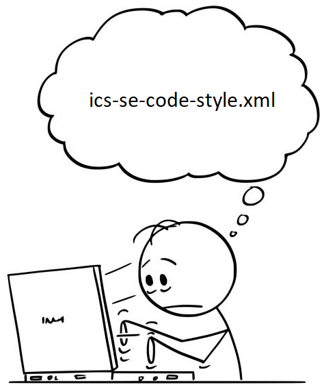

## Capitalize the First Word, Nouns, Pronouns, Adjectives, Verbs and Adverbs

When I think of errors, the first thing that comes to my head is that annoying red squiggly line that appeared in every single one of my Word documents as a kid because my name, Evan, apparently wasn't in the dictionary. Today, that annoying red squiggly line is still present but instead of is being under my name (it still is), it's now under every single tiny minute detail that I, apparently, didn't pay attention to when coding to a certain code style. It's everywhere. Is it still annoying? Yes. Is it necessary? You could argue against it. Is it important? Absolutely.

So why do these red lines appear? My code looks fine and it runs fine, why is it needed? Well in addition to helping debug programs when it doesn't run in the first place, it allows each program that adheres to the code style to be formatted similarly and designed the same way. It allows your code to be readable to people that use the same style and allows your code to be near in nature to any other programs you run under this style. It's like formatting an essay you would do back in highschool, where each essay needs to be 12pt font, Times New Roman, and double spaced. You could write the whole essay in 11pt font, Arial, and 1.15 spaced since it's still the same essay, but it becomes much more complex to understand the more you drift away from the standardized style.

After using IntelliJ for around a week now, I can safely say that it's just like Eclipse, but better. Since IntelliJ was created as a commerical product, it's much more refined than Eclipse and has much more built in functionality, like connecting to GitHub and having a much more expansive debugger. For my ICS 314 class we have to use a certain code style to conform to a standard of writing, mainly so that our code can be readable and understood properly. When I first used a coding style in ICS 211, I thought it was annoying since I already had a personal coding standard that I used. It wasn't too hard to transition, since most of the time I would write in my style first, then conform it to the style. I still somewhat do this but I usually try to write in the coding style first then make small edits later. Try to get it right first then modify. I do really appreciate that IntelliJ has a hotkey to look at each error and shows you where it is, something that I wished JSFiddle did. It's a bit annoying to see the red error warning at first, but it's surprisingly fun to whittle it down to 0 since most of the time they are small errors and if it broke the program I would have been annoyed at that instead of the style errors.

If Grammerly worked with this text editor it would tell me to make proper headers. I won't.

## Line 24: Header is defined but never used
