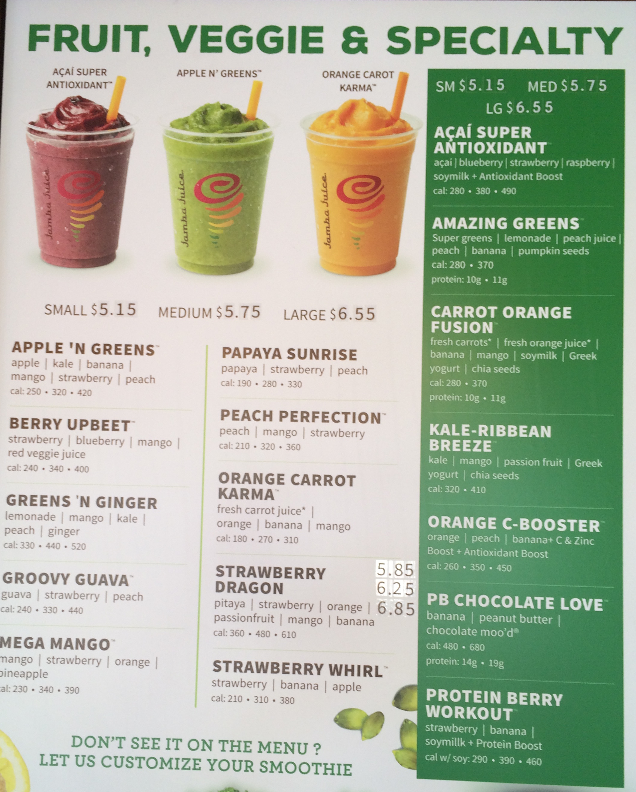
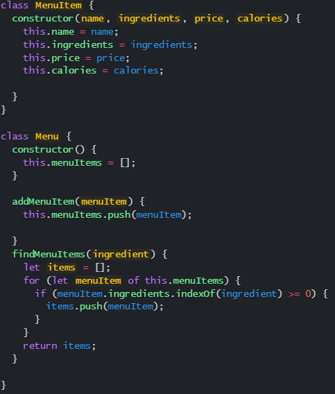
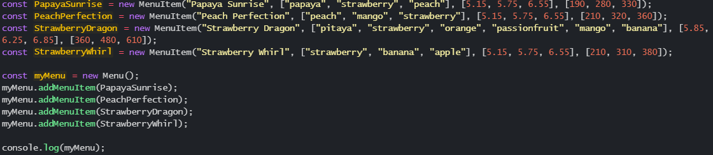
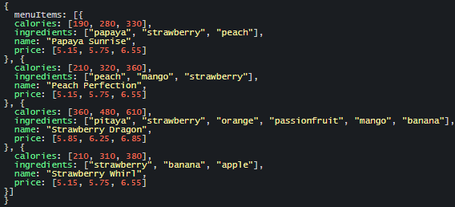

Javascript is a scripting language created by Brendan Eich in 1995 that was originally used for the Netscape Navigator web browser. In my ICS 314 class we use it as a means to study software engineering and to create short programs to experience programming. 

In one of our practice assignments we were asked to create a program revolving around a Jamba Juice menu through the use of classes and constructor. This was a very useful, albiet confusing, assignment to properly learn this concept as foods and drinks have many different components that need to be accounted for when eating and ordering them. I think the most outstanding part of this was understanding the concept of how objects can be comprised of other objects attatched to it, as each drink had a name, a list of ingredients, a corresponding price per size, and calorie count per size. Although this concept may seem elementary, as we know that everything in this world is comprised of other things down to a microbial level, but the methods of referring to each derived object and the functions using them were a bit confusing to grasp.

I think creating a menu based project to learn class and constructors was a very smart decision by my professor, as it's a very simple process to learn as it's something we have to think about everytime we want to order something. The class and constructor is something that we can apply to many other topics such as jobs, mobs in video games, or how our simple computer works. It was a confusing process to learn but I think by doing this I have a greater understanding of how class and constructors work and how I can apply it to other obejcts.

Here is some code to illustrate the constructor, an example class, and the test functions and the output

[Source](http://courses.ics.hawaii.edu/ics314s23/morea/javascript-2/experience-jamba-juice-1.html)
